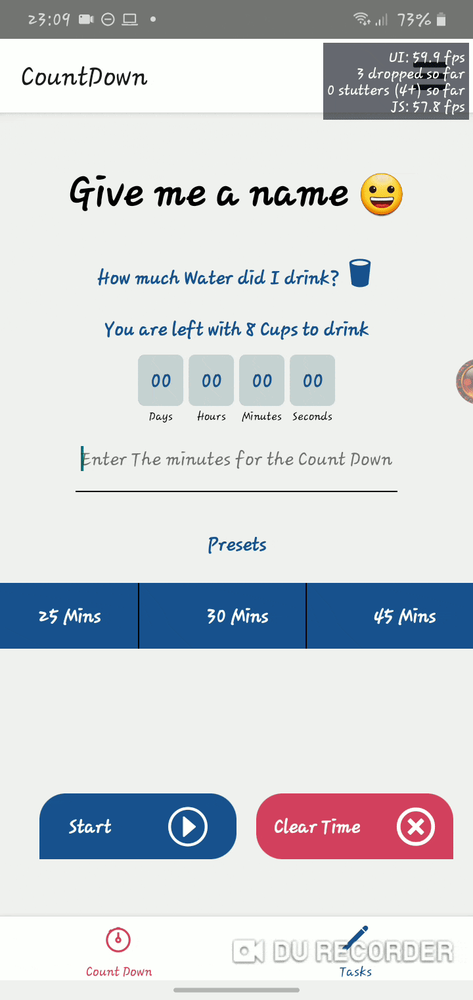
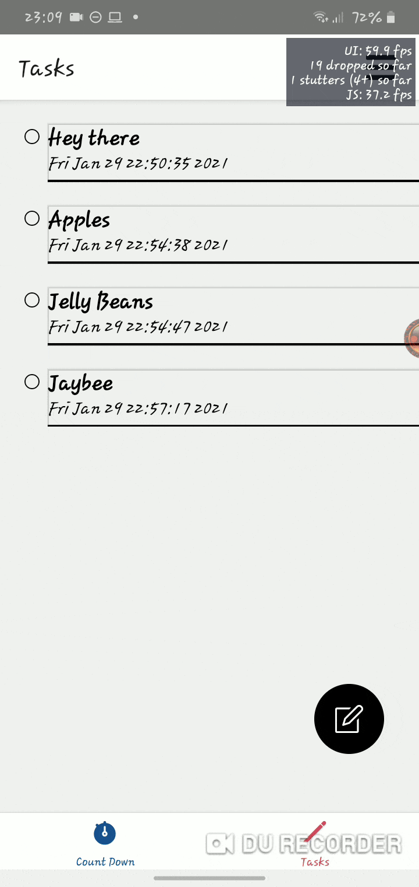
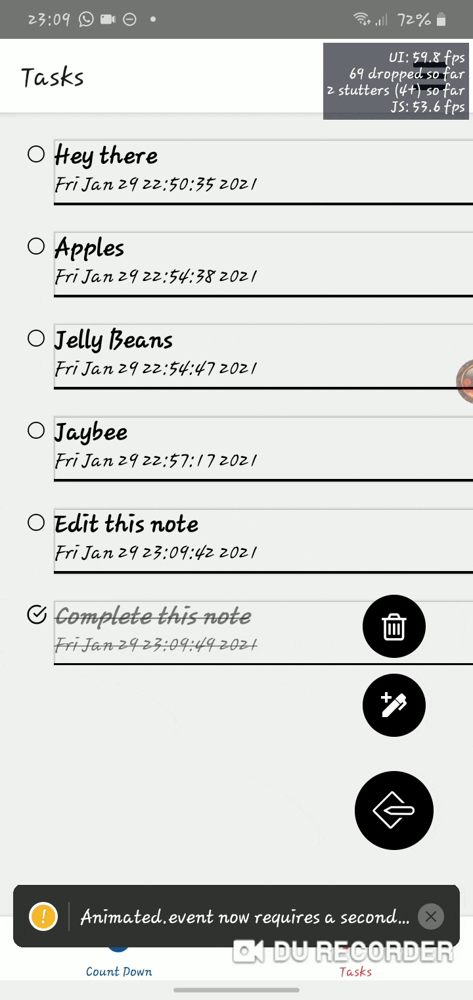

# **Study Time App** ⏱️ 📚

## 📓 Description 📓
**The app currently is only developed for Android.**
---
The app's purpose is to help the user set goals or objectives during the time they are studying. The app has a countdown clock that will accept minutes as input. The other screen at the bottom tab has a todo list or check list. This can help track goals the user wants to complete within the given time. When the timer is over it alerts the user within the app and also outside the app. Theres a pop up message that encourages breaks of at least 5 minutes.
>Count Down Clock Features
* The clock can accept input from the user, but the clock can also use preset times to start the timer.
* When the clock starts a reminder is set to notify the user when the countdown has ended. The user can exit the app or go into other apps and the reminder will still alert them.
* The user can also stop or cancel the timer before it reaches the end.

>Task Checklist Features
* The user can add as many tasks as they want.
* The screen auto reloads after an action has been completed, for example adding a task or deleting a task.
* If the user wants to reload the list manually they can pull down from the top of the screen.
* The app can do the following actions: 
    * Swiping from the left marks the task as complete and the changes will reflect immediately.
    * Swiping from the right of the screen will bring up a delete confirm box in order to delete that specific task.
    * Tapping on the list item will allow you to edit in case theres a spelling mistake. 

## 🚧 **Known Issues** 🚧
* When canceling the timer the scheduled notification service will still run. This means the notification will still appear even when the clock has been cancelled or stopped before the end of the specified time.
* The countdown component uses state to listen for any changes. If the user happens to type random numbers or can take too long, the app could crash. Its best to restart the app in this case.
* When editing tasks on the 'Task Checklist' the edit screen may close while trying to edit the task, in this case its best to delete the task and create another one.
* All yellow box warnings have been removed: 
    * The yellow warning box on the 'Count Down Clock' screen complains how the input for the timer should not be a string when the input is empty, but the warning disappears when the timer starts.
    * The error 'this.textInput.clear' is meant to clear input after entering, but the app still works with this error. The function clearTimeInput is supposed to clear the keyboard.
    ```javaScript
    clearTimeInput = () => {
        this.setState({
        time: '',
        });
        Keyboard.dismiss();
        this.textInput.clear();
    };
    ```
    * The yellow box warning is on the tasks screen, it complains about a second Animation.event but it doesn't hinder the components from working.

## 📱Demos📱

>Setting Timer
#

---
---

>Adding Tasks and Completion
#

---
---

>Editing and Deleting Tasks
#

---

## *Footer Notes*
* As time goes on I might tweak the features and try to improve it in some way.
    * Am not creating apps full time yet so these are side projects, as react native is a hybrid framework and it may not be able to do most things a native app would do.
* This repo is free to use, practice, mess around with or even improve it. 🤪
* Below is a check list of things that I hope to do of course the list will change over time. 😅


# **CheckList**
>BackEnd Stuff
- [x] Create Count Down Clock.
- [x] Create Task CheckLists.
- [x] Configure Realm with Task CheckLists Screen.
- [x] Configure Count Down Clock.

>Visuals and FrontEnd
- [x] Add a Splash Screen.
- [ ] Add some cool animations.
- [ ] Make it colorful.
- [ ] Look up some designs.
